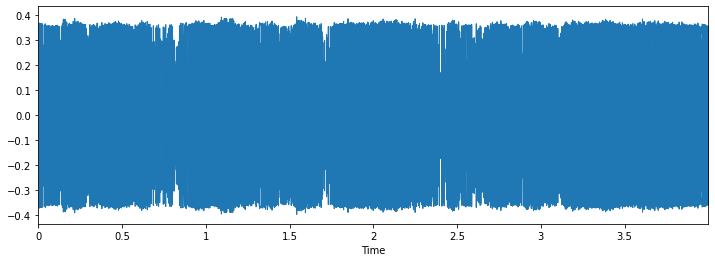
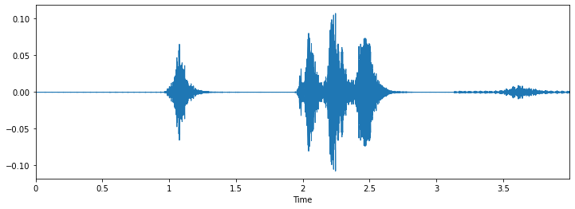
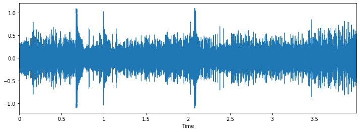
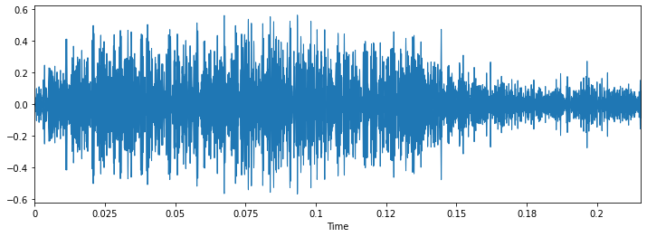
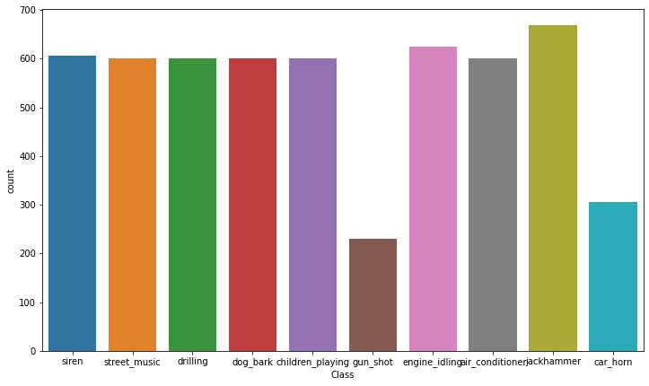

# Urban_Sound_Classification
Developed a machine learning pipeline to classify urban environmental sounds (e.g., sirens, dog barks, drilling) using the UrbanSound8K dataset. Applied feature extraction techniques such as Mel-spectrograms and MFCCs, and trained Convolutional Neural Networks (CNNs) for accurate sound recognition.

